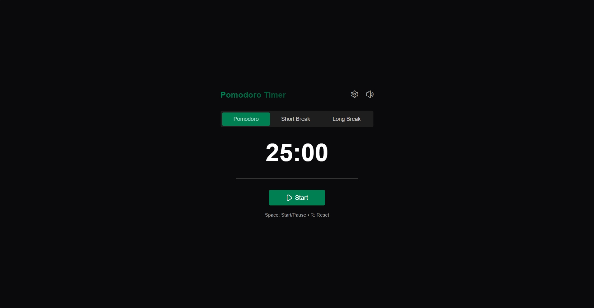
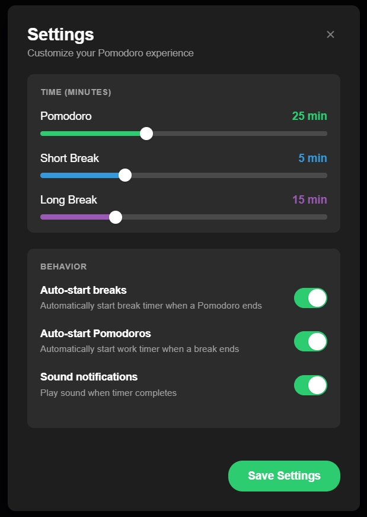

# Pomodoro Timer

A little project of a simple Pomodoro timer using HTML, CSS, and vanilla JS.

## Features

*   **Three Timer Modes:**
    *   Pomodoro: For focused work sessions.
    *   Short Break: For quick rests between Pomodoros.
    *   Long Break: For longer rests after a set number of Pomodoros.
*   **Customizable Durations:** Easily adjust the time for each mode (Pomodoro, Short Break, Long Break) through the settings panel.
*   **Visual Progress Bar:** See how much time is left at a glance.
*   **Sound Notifications:** Get an audio alert (a gentle bell) when a timer session ends.
    *   **Volume Control:** Easily mute or unmute sound notifications.
*   **Automatic Transitions:**
    *   Configure the timer to automatically start breaks after a Pomodoro session.
    *   Configure the timer to automatically start the next Pomodoro after a break.
*   **Dynamic Theming:** The color scheme of the timer changes to reflect the current mode (Pomodoro, Short Break, or Long Break), providing a visual cue.
*   **Keyboard Shortcuts:**
    *   `Spacebar`: Start or Pause the timer.
    *   `R`: Reset the current timer.
*   **Settings Panel:** Access all customization options in a clean and intuitive modal.
*   **Responsive Tab Title:** The browser tab title dynamically updates to show the current timer and mode.

## Technologies Used

*   HTML
*   CSS
*   JavaScript

## Preview

*Main timer interface*

*Settings panel*

